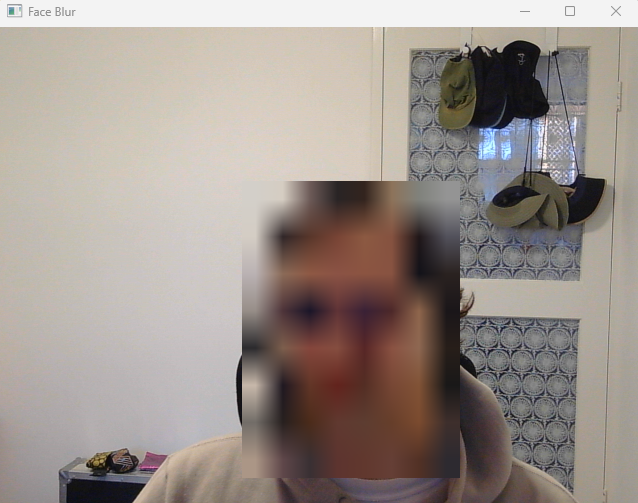

# Object Detection Apps

A collection of simple but practical object detection apps using YOLO models and OpenCV.

## Face Blur

An app that uses a fine tuned model of YOLO v11 to detect faces in a live webcam feed and applies mosaic pixelation to any faces it finds.

### To run

cd face-blur

pip install opencv-python
pip install ultralytics

Go to https://github.com/akanametov/yolo-face scroll down to the "Models" section and download yolov11n-face.pt and place it in the root directory

Then, run main.py
